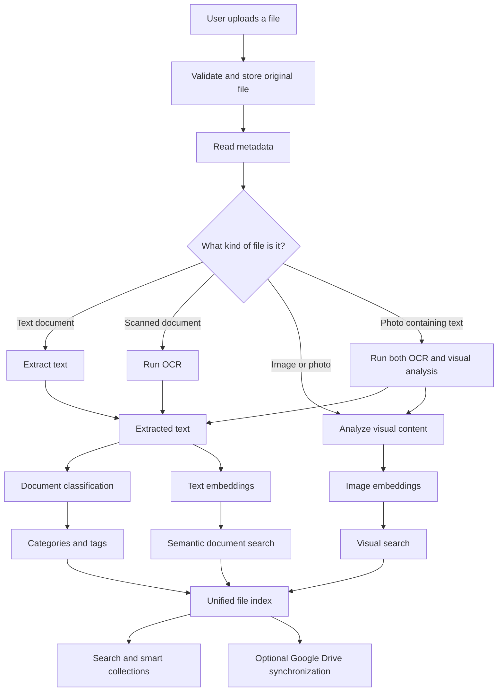
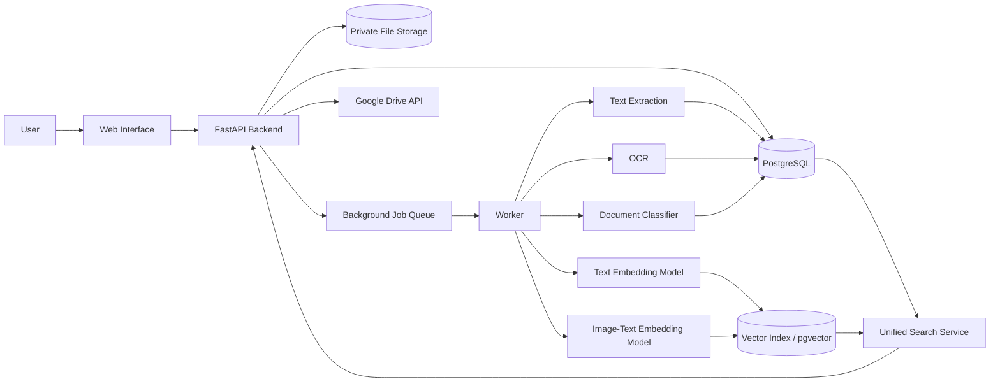
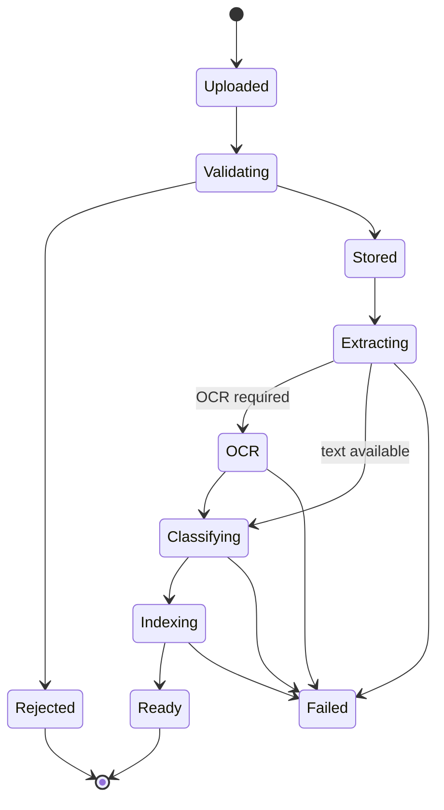
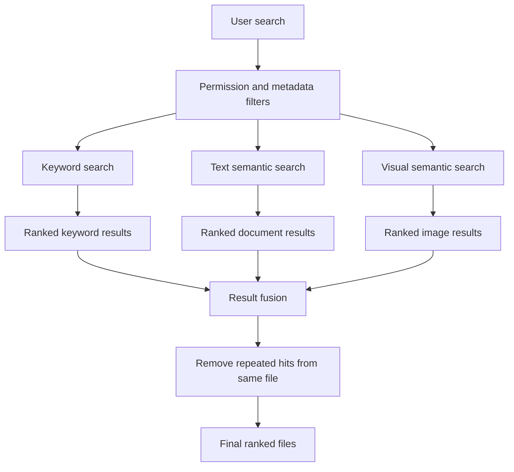

# Multimodal Smart File Organizer

A smart file-management project that combines **document understanding**, **image understanding**, **semantic search**, and **cloud storage** in one system.

The goal is simple:

> Instead of forcing users to remember filenames and folders, the system should understand what a file contains and help the user find it later.

This project extends the idea of a traditional smart document organizer into a **multimodal organizer** that can work with both documents and images.

---

## Why this project exists

Most file managers organize files using:

- filenames
- folders
- file extensions
- dates
- manually added tags

That works for a small number of files, but it becomes difficult when a user has hundreds or thousands of PDFs, scans, screenshots, receipts, photos, notes, and other files.

A file may be called:

```text
IMG_2048.jpg
document_final.pdf
scan_001.pdf
new_file_3.docx
```

Those names tell us almost nothing about the actual content.

This project aims to make files searchable by **what they contain**, not only by what they are called.

---

## Example

Imagine that a user has these three files:

```text
invoice_01.pdf
IMG_8831.jpg
holiday_photo.jpg
```

The first file is a digital invoice.

The second file is a photograph of another invoice.

The third file is a beach photograph.

A normal file manager mainly sees three filenames.

Our system should eventually understand them more like this:

```text
invoice_01.pdf
├── Type: PDF
├── Extracted text: ...
├── Suggested category: Invoice
└── Searchable as a document

IMG_8831.jpg
├── Type: Image
├── OCR text: ...
├── Suggested category: Invoice
├── Visual representation: created
└── Searchable as both an image and a document

holiday_photo.jpg
├── Type: Image
├── Visual representation: created
└── Searchable using descriptions such as "beach" or "sea"
```

A search for:

```text
invoice
```

should be able to return both the PDF invoice and the photographed invoice.

A search for:

```text
beach
```

should be able to return the beach photograph even if the filename does not contain the word `beach`.

---

# Main idea

The system uses different processing methods for different kinds of files.

It does **not** depend on one giant AI model.

Instead, specialized components work together.



---

# What makes this project different?

The project combines two ideas.

### 1. Smart document organizer

Documents can be processed using:

- metadata extraction
- text extraction
- OCR
- document classification
- keyword search
- semantic search

### 2. Smart gallery-style search

Images can be processed using:

- image embeddings
- text-to-image search
- image similarity
- OCR for screenshots and photographed documents

Both systems share the same file library and search interface.

This means one file can have more than one useful representation.

For example, a photograph of a receipt can be:

- an image
- an OCR text source
- a financial document
- part of a smart collection
- a semantic-search result

The original file is still stored only once.

---

# Planned system architecture



The project will begin as a **single application with modular components**. We are intentionally avoiding unnecessary microservices during the early development stage.

---

# Machine-learning plan

The first version is designed to train only **one custom ML model**.

| Component | Purpose | Approach |
|---|---|---|
| Document classifier | Predict document category | **Train ourselves** |
| Text embedding model | Semantic document search | Pretrained |
| Image-text embedding model | Gallery and visual search | Pretrained |
| OCR | Read text from images and scans | Pretrained OCR engine |

## Custom model

Our first custom model will classify extracted document text into categories such as:

```text
Invoice
Receipt
Resume
Contract
Academic Document
```

The initial approach will be:

```text
Document text
      ↓
TF-IDF
      ↓
Logistic Regression
      ↓
Predicted document category
```

The categories may change as the dataset is developed.

The system must also support a state such as:

```text
NEEDS_REVIEW
```

so that uncertain files are not forced into an incorrect category.

---

# File-processing workflow

A newly uploaded file will move through several stages.



Processing will eventually happen in background workers so users do not have to keep an upload request open while OCR or AI processing runs.

---

# Search architecture

The project will not depend on only one search method.

It will combine multiple retrieval techniques.



This design allows queries such as:

```text
invoice
electricity bill
beach
restaurant receipt
college document
2026 reports
```

Exact filters such as dates, file types, ownership, and categories should be handled explicitly instead of relying only on AI similarity.

---

# Smart collections

The organizer will support virtual collections.

Examples:

```text
Invoices
Receipts
Academic Documents
Photos
Screenshots
Recently Added
Needs Review
Possible Duplicates
```

A virtual collection does not need to create another physical copy of the file.

One file can belong to several collections while the original remains stored once.

---

# Duplicate detection

Duplicate handling will be implemented in two stages.

### Exact duplicates

A cryptographic file hash can identify files with identical content.

### Near duplicates

Later versions can compare visual or semantic similarity to suggest files that may be related or almost identical.

The system should **not automatically delete files simply because two files look similar**.

Deletion or merging should remain a user-controlled action.

---

# Google Drive integration

Google Drive will be an optional cloud-storage layer.

The first implementation will focus on a simple and safer workflow:

```text
User uploads file
        ↓
Application stores original
        ↓
Application processes and indexes file
        ↓
Authorized copy is uploaded to Google Drive
        ↓
Drive file ID and synchronization status are recorded
```

Full two-way synchronization and conflict resolution can be added later.

---

# Planned technology stack

| Area | Technology |
|---|---|
| Backend | Python + FastAPI |
| Frontend | React |
| Database | PostgreSQL |
| Vector search | pgvector |
| ORM | SQLAlchemy |
| Database migrations | Alembic |
| Background jobs | Celery |
| Queue / broker | Redis |
| Document ML | scikit-learn |
| Text embeddings | Sentence Transformers |
| Image-text embeddings | CLIP-compatible model |
| OCR | Tesseract / pytesseract |
| PDF text extraction | pdfminer.six |
| DOCX extraction | python-docx |
| Cloud integration | Google Drive API |
| Packaging | Docker |
| Testing | pytest |

The stack may evolve while the project is being tested.

---

# Initial supported file types

The first practical version will focus on:

```text
PDF
DOCX
TXT
JPG
JPEG
PNG
```

Other formats can be added after the base pipeline is stable.

---

# Development roadmap

The project will be built incrementally.

## Milestone 0 — Project foundation

- repository structure
- README
- environment configuration
- FastAPI starter application
- testing setup
- Docker foundation
- architecture documentation

## Milestone 1 — File upload and storage

- upload endpoint
- file validation
- private storage
- metadata extraction
- SHA-256 hashing
- asset records

## Milestone 2 — Document extraction

- PDF text extraction
- DOCX extraction
- TXT processing
- scanned-document detection

## Milestone 3 — OCR

- image OCR
- scanned PDF OCR
- OCR error handling
- extracted-text storage

## Milestone 4 — ML dataset

- category definitions
- labeled dataset format
- dataset validation
- train / validation / test split
- leakage checks

## Milestone 5 — Document classifier

- TF-IDF pipeline
- Logistic Regression model
- evaluation
- confidence handling
- model versioning
- NEEDS_REVIEW workflow

## Milestone 6 — Text semantic search

- document chunking
- text embeddings
- pgvector storage
- semantic retrieval
- search evaluation

## Milestone 7 — Gallery intelligence

- image embeddings
- text-to-image search
- image similarity
- screenshot and photo handling

## Milestone 8 — Unified multimodal search

- keyword retrieval
- document semantic retrieval
- image semantic retrieval
- filters
- ranking fusion
- result deduplication

## Milestone 9 — Smart organization

- virtual collections
- tags
- duplicate suggestions
- review queue

## Milestone 10 — Background processing

- Redis
- Celery workers
- retry handling
- recoverable processing jobs

## Milestone 11 — Google Drive

- OAuth connection
- upload workflow
- Drive file mapping
- retry and failure handling
- synchronization status

## Milestone 12 — Frontend

- upload interface
- document list
- gallery
- search interface
- smart collections
- review interface

## Milestone 13 — Feedback and retraining

- correction capture
- reviewed training examples
- candidate model training
- evaluation before deployment
- model rollback

## Milestone 14 — Security and testing

- authentication
- file ownership checks
- secure file access
- integration tests
- failed-job tests
- retrieval tests

## Milestone 15 — Deployment and monitoring

- Docker Compose
- production configuration
- persistent storage
- database backups
- logs
- monitoring
- deployment documentation

---

# Project principles

While building the system, we will follow a few important rules.

### Preserve the original

Uploaded files should not be silently modified.

### AI suggests; application rules decide

Machine-learning models may suggest categories, tags, and similarity.

Sensitive operations such as deleting, replacing, or sharing files should remain controlled by deterministic application logic and user authorization.

### One file, many representations

A file may have:

- extracted text
- OCR text
- metadata
- document category
- text embeddings
- image embeddings
- tags
- collection memberships

These are derived representations of the same original asset.

### Search should respect permissions

Every search must be restricted to files the current user is allowed to access.

### Uncertainty is allowed

The system should be able to say:

```text
Needs review
No reliable text extracted
No strong search match
Processing failed
```

instead of inventing a confident result.

### Training is separate from normal usage

Uploading a new file does not retrain the ML model.

Normal use:

```text
New file
   ↓
Existing models run inference
   ↓
Predictions and embeddings are stored
```

Model development:

```text
Reviewed labeled data
   ↓
Train candidate model
   ↓
Evaluate
   ↓
Deploy only if accepted
```

---

# First proof of concept

Before building every feature, we will prove that the core idea works with only three files.

```text
1. A digital invoice PDF
2. A photograph of an invoice
3. A normal beach photograph
```

The prototype should demonstrate:

1. searching for **invoice** finds both invoice files;
2. searching for **beach** finds the beach photograph;
3. every result points back to the preserved original file.

If these three behaviors work together, the central multimodal architecture has been demonstrated.

---

# Repository structure

The planned structure is:

```text
multimodal-smart-file-organizer/
│
├── app/
│   ├── api/
│   ├── core/
│   ├── db/
│   ├── ingestion/
│   ├── extractors/
│   ├── intelligence/
│   ├── retrieval/
│   ├── organisation/
│   ├── integrations/
│   └── workers/
│
├── frontend/
├── training/
├── evaluation/
├── tests/
├── migrations/
├── artifacts/
├── docs/
├── deploy/
│
├── .env.example
├── .gitignore
├── pyproject.toml
├── docker-compose.yml
└── README.md
```

This structure will be created gradually as each milestone begins.

---

# Current project status

🚧 **Early development / project foundation**

Current focus:

```text
Milestone 0
Project architecture and development foundation
```

The README describes the planned system. Features should not be considered complete until their corresponding milestone has been implemented and tested.

---

# Research origin

The project began from a smart file-organizer concept based on:

- automatic file categorization
- metadata extraction
- OCR
- machine-learning classification
- intelligent retrieval
- Google Drive synchronization

The project then expands that idea with gallery-style visual understanding and multimodal search.

The implementation in this repository is being designed independently, with its own architecture, code, experiments, evaluation process, and documentation.

---

# Long-term possibilities

After the core system is stable, possible extensions include:

- multilingual search
- better handwritten-document recognition
- face grouping as an optional privacy-sensitive feature
- video indexing
- multi-cloud storage
- voice-based search
- natural-language question answering over personal files
- local/on-device inference
- personalized classification models

These are future directions and are not part of the first MVP.

---

# Contribution status

The project is currently being developed step by step.

Contribution guidelines will be added after the core architecture and development workflow are stable.

---

## Project goal in one sentence

> **Build a file organizer that can understand documents and images well enough to help users organize and retrieve files by content rather than by filename alone.**
