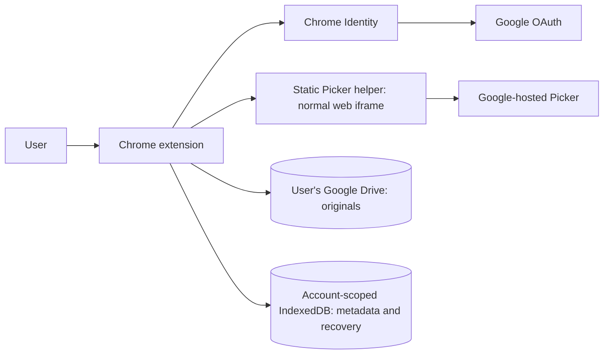

# Architecture

## Current foundation

Filewise is a Manifest V3 Chrome extension. Each user connects their own Google account.
Originals are uploaded directly to that account's Drive or registered as references to
existing user-selected files. Production uses a static HTTPS Picker helper; no customer
database installation or local server is required. GitHub Pages hosts the helper; developers
can optionally serve it from a loopback-only Node process.

## Modules

| Module | Responsibility |
|---|---|
| `frontend/extension/src/auth.js` | Chrome tokens, stable Drive account identity, session epochs |
| `src/drive.js` | Drive REST client, per-file metadata, resumable transfer and bounded retry |
| `src/validation.js` | File policy, full UTF-8 validation, signatures, DOCX ZIP structure, hashing |
| `src/store.js` | IndexedDB transactions with account-scoped compound keys |
| `src/library.js` | Asset registration, upload journal, recovery, permission-aware access |
| `src/picker.js` | Validated web-helper handshake, private result channel, selection validation |
| `frontend/picker-bridge/picker.html`, `picker.js`, `config.js` | Static web helper, Google Picker SDK, allowed extension origins |
| `frontend/picker-bridge/serve.mjs` | Development-only loopback server for the static helper |
| `src/main.js`, `src/view.js` | Extension UI orchestration and safe rendering |

The `src` paths above are relative to `frontend/extension`.

## Account and storage boundaries

Only `drive.file` is requested. The extension works with app-created files and files explicitly
selected in Google Picker. Selecting a folder as a destination does not recursively authorize
its existing children. Imported originals are never moved or duplicated by this milestone.

Every local asset, setting and operation is keyed by the connected Drive account's stable
permission ID plus a record ID. Session epochs invalidate old work after account switches.
New or refreshed tokens are checked against that account before authenticated requests.
All incoming Picker IDs are re-read through Drive; messages cannot supply trusted metadata.
Metadata is refreshed against current Drive access before rendering the connected library.
Opening/downloading rechecks the local account record and current Drive permissions.

OAuth tokens are never written into IndexedDB, storage.local, helper URLs, or logs. The
extension validates the helper's ready message against its exact iframe window and configured
origin. Initialization then sends transient credentials to that exact origin while transferring
a private MessagePort for selected IDs and errors. The helper also checks its parent window
and the public extension-origin allowlist. It does not persist credentials or original files.
Google's remotely loaded SDK never executes in privileged extension pages.

## Picker web origin and deployment

Picker runs in a normal cross-origin web iframe directly inside the extension. It must not
have a sandbox attribute or a sandboxed ancestor. The previous extension sandbox forced
Google's nested frame into an opaque origin; the user's console showed CORS failures for
Google Picker resources from origin `null`, explaining the blank content beneath the dialog
shell. The separate `frame-ancestors` warning was report-only.

The normal web helper preserves its own origin and the Google frame's origin while remaining
separate from extension APIs and DOM access. `PickerBuilder.setOrigin()` identifies the
topmost extension page, as required when Picker is embedded in an iframe. This change targets
the confirmed CORS failure; the user subsequently reported live file/folder selection working.

The hosted helper URL is
<https://siddharthaganguli.github.io/multimodal-smart-file-organizer/>, configured through
`googlePickerBridgeUrl`. Its dedicated `gh-pages` branch contains only `index.html`,
`picker.js`, and `config.js`. The three HTTPS files have been verified to return HTTP 200
and match the reviewed source byte for byte. Browser verification of the hosted integration
passed with dummy OAuth; the user reports the authenticated workflow working. The extension
implementation has not been merged into `main`.

Optional local development uses `http://127.0.0.1:8765/picker.html`. The dependency-free
server binds only to loopback and serves a fixed HTML/JavaScript/config allowlist. Neither
hosting method introduces a file-storage backend: the host serves code, while transient
credentials pass between browser frames and Google.

See [extension setup](extension-setup.md) for local commands, hosting instructions, and the
remaining live acceptance checks. The ordinary workflow is user-reported as working;
account/recovery edge cases have automated coverage but still need individual live confirmation.

## Upload transaction and recovery

1. Validate the full local file and calculate SHA-256, without changing bytes.
2. Resolve/create an authorized destination folder. Folder creation is journaled with a fixed ID.
3. Generate a Drive file ID and persist an account-scoped pending operation before mutation.
4. Initiate resumable upload; persist its trusted Google session URL before sending bytes.
5. Transfer bytes. Query offsets or reconcile by the same file ID after uncertain responses.
6. Commit canonical file metadata, then remove the pending operation.

If step 6 fails after Drive succeeds, the journal remains. Recovery fetches the same Drive ID,
checks its size and available checksum, and finishes the metadata commit. It does not allocate
a replacement ID. An unfinished transfer requires the user to reselect the same original;
its checksum must match. Original bytes are never persisted locally by the app.

Closing the extension tab may interrupt transfer. Keep it open until completion. Local
IndexedDB is not a cross-device backup; uninstalling removes the local index/journal but
leaves originals in Drive. Duplicate suggestion/merging is a later, user-controlled feature.

## Validation limits

The MVP accepts PDF, DOCX, UTF-8 TXT, JPG/JPEG and PNG up to 20 MB for upload/download
through the extension. PDF/image validation checks signatures, not complete renderability.
DOCX checks bounded ZIP structure and required entries without inflating arbitrary archive
contents. Parser/OCR robustness and deeper corrupted-document handling remain extraction work.
Existing Drive registration trusts supported canonical MIME metadata and does not download
all originals merely to build a file list. Native Google Docs/Sheets require future export support.

## Search and future intelligence

The current search filters registered filenames locally. Assets are marked not processed.
Later workers will derive text/OCR, categories, embeddings and search indexes ahead of queries.
Automatic category folders must operate only within the user's authorized organization scope
and preserve original content. Permission filters apply to every search and retrieval path.

The Python FastAPI packages remain a scaffold for optional future hosted processing. PostgreSQL,
pgvector, Redis and Celery are possible developer-operated infrastructure, not software users
must install. The implementation boundary for later ML work remains to be chosen. Drive is the
primary original store; the earlier private-server-original architecture has been superseded.

Training is separate from inference. Low confidence should lead to review, and model similarity
never independently authorizes deletion, replacement, sharing or movement of files.
