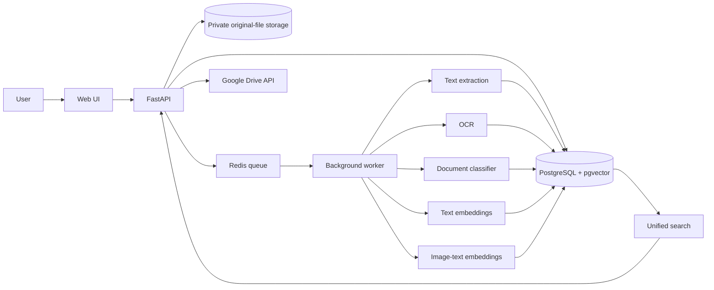
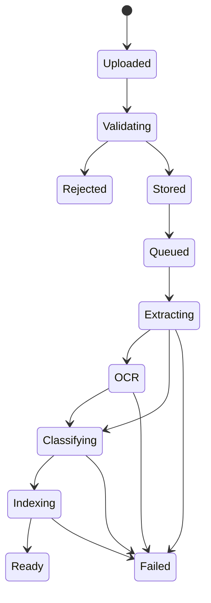

# Architecture

This document describes the planned architecture of the Multimodal Smart File Organizer.

## Design goal

Preserve one original asset while allowing multiple derived representations: metadata, extracted text, OCR text, document predictions, text embeddings, image embeddings, tags, and collection memberships.

## High-level architecture

## Core boundaries

### API layer
FastAPI owns request validation, authentication, authorization, resource endpoints, job status, and orchestration. Heavy OCR and ML work should move to background workers.

### Private storage
Original files are preserved without silent modification. Internal storage paths must never be derived directly from untrusted filenames.

### Database
PostgreSQL will hold users, assets, processing states, extracted representations, labels, collections, feedback, cloud mappings, and audit information. pgvector will later store model-specific vectors.

### Background processing
Redis and Celery are planned for OCR, embeddings, classification, preview generation, retries, and Drive uploads.

### Intelligence layer
The first release separates specialized capabilities:
1. one custom document-category classifier;
2. one pretrained text embedding model;
3. one pretrained image-text embedding model;
4. a pretrained OCR engine.

Training and normal inference remain separate workflows.

### Retrieval layer
Search combines keyword retrieval, text semantic retrieval, visual retrieval, and exact filters. Ranking fusion happens after each retrieval path produces its own results.

### Cloud integration
Google Drive is optional. Local processing and search should remain usable if a Drive upload fails.

## Processing lifecycle

Not every asset uses every state. For example, a normal photograph may skip document classification if it contains no useful document text.

## Package map

| Package | Responsibility |
|---|---|
| `app.api` | HTTP routes and schemas |
| `app.core` | Configuration and shared utilities |
| `app.db` | Database models, sessions, repositories |
| `app.ingestion` | Upload validation, hashing, metadata, storage |
| `app.extractors` | PDF/DOCX/TXT extraction and OCR adapters |
| `app.intelligence` | Classifier and embedding wrappers |
| `app.retrieval` | Keyword/vector retrieval and rank fusion |
| `app.organisation` | Tags, collections, duplicate suggestions |
| `app.integrations` | Google Drive and future external services |
| `app.workers` | Background jobs, retries, recovery |

## Security assumptions

- Every retrieval path must enforce authorization.
- User-provided filenames are not trusted as storage paths.
- Secrets stay out of Git.
- ML similarity is never permission to delete or overwrite a file.
- User corrections remain distinguishable from model predictions.

## MVP proof

The first multimodal proof uses:
1. a digital invoice PDF;
2. a photograph of an invoice;
3. a beach photograph.

The MVP succeeds when `invoice` retrieves both invoice assets, `beach` retrieves the beach photo, and every result resolves to its preserved original.
